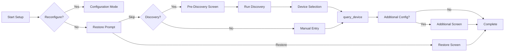

# Setup Flow Guide

The setup flow handles user interaction during device configuration. It provides a standard flow with extension points for customization.

## Overview

The setup flow follows this pattern:



## Key Concept: Unified Flow

Both discovery and manual entry paths converge on `query_device()`. This means you only implement device validation logic once:

- **Manual entry** → `query_device(input_values)`
- **Discovery selection** → `prepare_input_from_discovery()` → `query_device(input_values)`

## Basic Setup Flow

The simplest setup flow requires implementing `get_manual_entry_form()` and `query_device()`:

```python
from ucapi_framework import BaseSetupFlow
from ucapi.api_definitions import RequestUserInput

class MySetupFlow(BaseSetupFlow[MyDeviceConfig]):
    """Minimal setup flow."""
    
    def get_manual_entry_form(self) -> RequestUserInput:
        """Define the manual entry form."""
        return RequestUserInput(
            title="Add Device",
            settings=[
                {
                    "id": "address",
                    "label": {"en": "Device IP Address"},
                    "field": {"text": {"value": ""}},
                },
                {
                    "id": "name",
                    "label": {"en": "Device Name"},
                    "field": {"text": {"value": ""}},
                },
            ],
        )
    
    async def query_device(self, input_values: dict) -> MyDeviceConfig:
        """Create config from user input (works for both manual and discovery)."""
        return MyDeviceConfig(
            identifier=input_values.get("identifier", input_values["address"].replace(".", "_")),
            name=input_values["name"],
            host=input_values["address"],
        )
```

## Extension Points

### Restore Prompt

When a user starts initial setup (not reconfiguration), they are first asked if they want to restore from a backup. This is useful when upgrading integrations to allow users to import their previous configuration without having to set up a new device first.

The default prompt asks: "Are you upgrading this integration? If you have a configuration backup, you can restore it now. Otherwise, continue with the setup process to add a new device."

You can customize this message:

```python
async def get_restore_prompt_text(self) -> str:
    """Customize the restore prompt message."""
    return (
        "Welcome to MyDevice Integration v2.0! "
        "If you're upgrading from v1.x, you can restore your "
        "previous configuration. Otherwise, continue with setup."
    )
```

The restore prompt:

- Appears before any other setup screens during initial setup
- Shows a checkbox for "Restore from backup"
- If checked, goes directly to the restore screen
- If unchecked, continues with normal setup flow (pre-discovery → discovery → manual entry)

This also appears when users select "Reset" in configuration mode, allowing them to restore after clearing their configuration.

### Pre-Discovery Screens

Collect information before running discovery (API keys, server addresses, etc.):

```python
async def get_pre_discovery_screen(self) -> RequestUserInput | None:
    """Screen shown before discovery."""
    return RequestUserInput(
        title="Authentication",
        settings=[
            {
                "id": "api_key",
                "label": {"en": "API Key"},
                "field": {"text": {"value": ""}},
            },
        ],
    )

async def handle_pre_discovery_response(
    self, msg: UserDataResponse
) -> SetupAction:
    """Process pre-discovery input."""
    # Data is automatically stored in self._pre_discovery_data
    # and merged with manual entry input later
    
    # Continue to discovery
    return await self._handle_discovery()
```

### Discovery to Input Conversion

When a user selects a discovered device, override `prepare_input_from_discovery()` to convert the discovered device data to the same format as manual entry:

```python
async def prepare_input_from_discovery(
    self, discovered: DiscoveredDevice, additional_input: dict
) -> dict:
    """Convert discovered device to input_values format."""
    return {
        "identifier": discovered.identifier,
        "address": discovered.address,
        "name": additional_input.get("name", discovered.name),
        "port": discovered.extra_data.get("port", 8080),
    }
```

The default implementation returns basic fields (`identifier`, `address`, `name`) plus any additional input fields.

### Additional Configuration

Collect device-specific settings after device selection:

```python
async def get_additional_configuration_screen(
    self, device_config: MyDeviceConfig, input_values: dict
) -> RequestUserInput | None:
    """Screen shown after query_device succeeds."""
    return RequestUserInput(
        title="Device Settings",
        settings=[
            {
                "id": "zone",
                "label": {"en": "Zone"},
                "field": {
                    "dropdown": {
                        "value": "main",
                        "items": [
                            {"id": "main", "label": {"en": "Main"}},
                            {"id": "zone2", "label": {"en": "Zone 2"}},
                        ],
                    }
                },
            },
        ],
    )

async def handle_additional_configuration_response(
    self, msg: UserDataResponse
) -> SetupAction:
    """Process additional configuration."""
    # Fields are auto-populated to self._pending_device_config
    # Just return None to save and complete
    return None
```

### Custom Discovery Fields

Add extra fields to the discovery result screen:

```python
def get_additional_discovery_fields(self) -> list[dict]:
    """Add custom fields to discovery screen."""
    return [
        {
            "id": "zone",
            "label": {"en": "Zone"},
            "field": {
                "dropdown": {
                    "value": "main",
                    "items": [
                        {"id": "main", "label": {"en": "Main Zone"}},
                        {"id": "zone2", "label": {"en": "Zone 2"}},
                    ],
                }
            },
        }
    ]
```

These additional input values are passed to `prepare_input_from_discovery()`.

## Device Validation Pattern

The framework provides `self.device_class` to enable calling class methods for validation. This keeps validation logic with your device class and allows reuse in the device's `connect()` method.

### Using Class Methods for Validation

Define a class method on your device for validation:

```python
from ucapi_framework import StatelessHTTPDevice
import aiohttp

class MyDevice(StatelessHTTPDevice):
    @classmethod
    async def validate_connection(cls, host: str, token: str) -> dict:
        """Validate connection and return device info.
        
        This method can be called during setup without creating a device instance.
        """
        async with aiohttp.ClientSession() as session:
            async with session.get(
                f"http://{host}/api/info",
                headers={"Authorization": f"Bearer {token}"}
            ) as resp:
                if resp.status != 200:
                    raise ConnectionError(f"Connection failed: {resp.status}")
                return await resp.json()
    
    async def connect(self):
        """Connect to device - can reuse validation logic."""
        try:
            info = await self.validate_connection(
                self._config.host,
                self._config.token
            )
            self._model = info.get("model")
            self._firmware = info.get("firmware")
            return True
        except ConnectionError:
            return False
```

Then use it in your setup flow:

```python
class MySetupFlow(BaseSetupFlow[MyDeviceConfig]):
    async def query_device(self, input_values: dict):
        """Validate device using device class method."""
        try:
            # self.device_class is available via the framework
            info = await self.device_class.validate_connection(
                host=input_values["host"],
                token=input_values["token"]
            )
            
            return MyDeviceConfig(
                identifier=info["device_id"],
                name=info.get("name", input_values["name"]),
                host=input_values["host"],
                token=input_values["token"],
                model=info["model"],
                firmware=info["firmware"]
            )
        except ConnectionError as e:
            _LOG.error("Connection validation failed: %s", e)
            return SetupError(error_type=IntegrationSetupError.CONNECTION_REFUSED)
```

**Benefits:**

- ✅ Validation logic stays with device class
- ✅ Can be reused in `connect()` method
- ✅ No device instance needed during setup
- ✅ Type-safe and discoverable
- ✅ Keeps setup flow clean and focused

### Alternative: Separate API Client

For complex APIs, you can also use a separate API client class:

```python
class MyAPIClient:
    """Standalone API client for device communication."""
    
    async def get_device_info(self, host: str, token: str) -> dict:
        """Get device information."""
        async with aiohttp.ClientSession() as session:
            async with session.get(f"http://{host}/api/info") as resp:
                return await resp.json()

# In device:
class MyDevice(StatelessHTTPDevice):
    def __init__(self, config):
        super().__init__(config)
        self._client = MyAPIClient()
    
    async def connect(self):
        info = await self._client.get_device_info(
            self._config.host,
            self._config.token
        )
        return info is not None

# In setup:
class MySetupFlow(BaseSetupFlow):
    def __init__(self, *args, **kwargs):
        super().__init__(*args, **kwargs)
        self._client = MyAPIClient()
    
    async def query_device(self, input_values):
        info = await self._client.get_device_info(
            input_values["host"],
            input_values["token"]
        )
        return MyDeviceConfig(...)
```

Both patterns work well - choose based on your preference and API complexity.

## Multi-Screen Flows

For complex setups requiring multiple screens:

```python
async def query_device(self, input_values: dict) -> MyDeviceConfig | RequestUserInput:
    """Query device and optionally show more screens."""
    # Test connection
    device_info = await self._api.get_device_info(input_values["address"])
    
    if not device_info:
        return SetupError(error_type=IntegrationSetupError.CONNECTION_REFUSED)
    
    # Store config for multi-screen flow
    self._pending_device_config = MyDeviceConfig(
        identifier=device_info["id"],
        name=input_values["name"],
        address=input_values["address"],
    )
    
    # Show additional screen
    return RequestUserInput(
        {"en": "Select Options"},
        [{"id": "option", "label": {"en": "Option"}, 
          "field": {"text": {"value": ""}}}]
    )
```

## Configuration Modes

The setup flow handles three configuration modes automatically:

- **ADD** - Add a new device
- **REMOVE** - Remove an existing device
- **RESET** - Clear all devices and configuration

## Backup & Restore

Backup and restore are automatically handled by the framework. Users can:

- **Export** configuration as JSON
- **Import** configuration from JSON

## Complete Example

See the [API Reference](../api/setup.md) for complete documentation of all methods and extension points.
