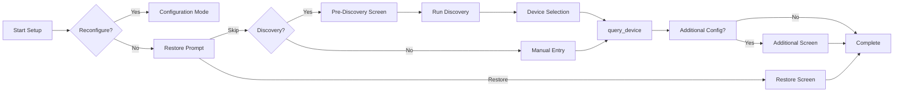

# Setup Flow Guide

The setup flow handles user interaction during device configuration. It provides a standard flow with extension points for customization.

## Creating a Setup Handler

Create a setup handler by calling `create_handler()` on your setup flow class:

```python
from ucapi_framework import BaseSetupFlow, BaseIntegrationDriver

# Create your driver with optional driver_id for migration support
driver = MyDriver(
    device_class=MyDevice,
    entity_classes=[MediaPlayer],
    driver_id="mydriver"  # Optional: enables auto-fetch of current version during migration and thus is only needed if migration is supported
)

# Create setup handler - driver_id is automatically extracted from driver
discovery = MyDiscovery(api_key="...", timeout=30)
setup_handler = MySetupFlow.create_handler(driver, discovery=discovery)
```

**Driver ID for Migration:**

The optional `driver_id` parameter on the `BaseIntegrationDriver` enables enhanced migration features:

- **Without `driver_id`**: Users must manually enter the current version during migration
- **With `driver_id`**: The framework automatically fetches the current version from the Remote using the integration's API

This improves user experience during entity ID migrations by reducing the information users need to provide. See [Entity ID Migration](#entity-id-migration) for details.

## Overview

The setup flow follows this pattern:



## Key Concept: Unified Flow

Both discovery and manual entry paths converge on `query_device()`. This means you only implement device validation logic once:

- **Manual entry** → `query_device(input_values)`
- **Discovery selection** → `prepare_input_from_discovery()` → `query_device(input_values)`

## Basic Setup Flow

The simplest setup flow requires implementing `get_manual_entry_form()` and `query_device()`:

```python
from ucapi_framework import BaseSetupFlow
from ucapi.api_definitions import RequestUserInput

class MySetupFlow(BaseSetupFlow[MyDeviceConfig]):
    """Minimal setup flow."""
    
    def get_manual_entry_form(self) -> RequestUserInput:
        """Define the manual entry form."""
        return RequestUserInput(
            title="Add Device",
            settings=[
                {
                    "id": "address",
                    "label": {"en": "Device IP Address"},
                    "field": {"text": {"value": ""}},
                },
                {
                    "id": "name",
                    "label": {"en": "Device Name"},
                    "field": {"text": {"value": ""}},
                },
            ],
        )
    
    async def query_device(self, input_values: dict) -> MyDeviceConfig:
        """Create config from user input (works for both manual and discovery)."""
        return MyDeviceConfig(
            identifier=input_values.get("identifier", input_values["address"].replace(".", "_")),
            name=input_values["name"],
            host=input_values["address"],
        )
```

## Extension Points

### Restore Prompt

When a user starts initial setup (not reconfiguration), they are first asked if they want to restore from a backup. This is useful when upgrading integrations to allow users to import their previous configuration without having to set up a new device first.

The default prompt asks: "Are you upgrading this integration? If you have a configuration backup, you can restore it now. Otherwise, continue with the setup process to add a new device."

You can customize this message:

```python
async def get_restore_prompt_text(self) -> str:
    """Customize the restore prompt message."""
    return (
        "Welcome to MyDevice Integration v2.0! "
        "If you're upgrading from v1.x, you can restore your "
        "previous configuration. Otherwise, continue with setup."
    )
```

The restore prompt:

- Appears before any other setup screens during initial setup
- Shows a checkbox for "Restore from backup"
- If checked, goes directly to the restore screen
- If unchecked, continues with normal setup flow (pre-discovery → discovery → manual entry)

This also appears when users select "Reset" in configuration mode, allowing them to restore after clearing their configuration.

### Pre-Discovery Screens

Collect information before running discovery (API keys, server addresses, etc.):

```python
async def get_pre_discovery_screen(self) -> RequestUserInput | None:
    """Screen shown before discovery."""
    return RequestUserInput(
        title="Authentication",
        settings=[
            {
                "id": "api_key",
                "label": {"en": "API Key"},
                "field": {"text": {"value": ""}},
            },
        ],
    )

async def handle_pre_discovery_response(
    self, msg: UserDataResponse
) -> SetupAction:
    """Process pre-discovery input."""
    # Data is automatically stored in self._pre_discovery_data
    # and merged with manual entry input later
    
    # Continue to discovery
    return await self._handle_discovery()
```

### Discovery to Input Conversion

When a user selects a discovered device, override `prepare_input_from_discovery()` to convert the discovered device data to the same format as manual entry:

```python
async def prepare_input_from_discovery(
    self, discovered: DiscoveredDevice, additional_input: dict
) -> dict:
    """Convert discovered device to input_values format."""
    return {
        "identifier": discovered.identifier,
        "address": discovered.address,
        "name": additional_input.get("name", discovered.name),
        "port": discovered.extra_data.get("port", 8080),
    }
```

The default implementation returns basic fields (`identifier`, `address`, `name`) plus any additional input fields.

### Additional Configuration

Collect device-specific settings after device selection:

```python
async def get_additional_configuration_screen(
    self, device_config: MyDeviceConfig, input_values: dict
) -> RequestUserInput | None:
    """Screen shown after query_device succeeds."""
    return RequestUserInput(
        title="Device Settings",
        settings=[
            {
                "id": "zone",
                "label": {"en": "Zone"},
                "field": {
                    "dropdown": {
                        "value": "main",
                        "items": [
                            {"id": "main", "label": {"en": "Main"}},
                            {"id": "zone2", "label": {"en": "Zone 2"}},
                        ],
                    }
                },
            },
        ],
    )

async def handle_additional_configuration_response(
    self, msg: UserDataResponse
) -> SetupAction:
    """Process additional configuration."""
    # Fields are auto-populated to self._pending_device_config
    # Just return None to save and complete
    return None
```

### Custom Discovery Fields

Add extra fields to the discovery result screen:

```python
def get_additional_discovery_fields(self) -> list[dict]:
    """Add custom fields to discovery screen."""
    return [
        {
            "id": "zone",
            "label": {"en": "Zone"},
            "field": {
                "dropdown": {
                    "value": "main",
                    "items": [
                        {"id": "main", "label": {"en": "Main Zone"}},
                        {"id": "zone2", "label": {"en": "Zone 2"}},
                    ],
                }
            },
        }
    ]
```

These additional input values are passed to `prepare_input_from_discovery()`.

## Device Validation Pattern

The framework provides `self.device_class` to enable calling class methods for validation. This keeps validation logic with your device class and allows reuse in the device's `connect()` method.

### Using Class Methods for Validation

Define a class method on your device for validation:

```python
from ucapi_framework import StatelessHTTPDevice
import aiohttp

class MyDevice(StatelessHTTPDevice):
    @classmethod
    async def validate_connection(cls, host: str, token: str) -> dict:
        """Validate connection and return device info.
        
        This method can be called during setup without creating a device instance.
        """
        async with aiohttp.ClientSession() as session:
            async with session.get(
                f"http://{host}/api/info",
                headers={"Authorization": f"Bearer {token}"}
            ) as resp:
                if resp.status != 200:
                    raise ConnectionError(f"Connection failed: {resp.status}")
                return await resp.json()
    
    async def connect(self):
        """Connect to device - can reuse validation logic."""
        try:
            info = await self.validate_connection(
                self._config.host,
                self._config.token
            )
            self._model = info.get("model")
            self._firmware = info.get("firmware")
            return True
        except ConnectionError:
            return False
```

Then use it in your setup flow:

```python
class MySetupFlow(BaseSetupFlow[MyDeviceConfig]):
    async def query_device(self, input_values: dict):
        """Validate device using device class method."""
        try:
            # self.device_class is available via the framework
            info = await self.device_class.validate_connection(
                host=input_values["host"],
                token=input_values["token"]
            )
            
            return MyDeviceConfig(
                identifier=info["device_id"],
                name=info.get("name", input_values["name"]),
                host=input_values["host"],
                token=input_values["token"],
                model=info["model"],
                firmware=info["firmware"]
            )
        except ConnectionError as e:
            _LOG.error("Connection validation failed: %s", e)
            return SetupError(error_type=IntegrationSetupError.CONNECTION_REFUSED)
```

**Benefits:**

- ✅ Validation logic stays with device class
- ✅ Can be reused in `connect()` method
- ✅ No device instance needed during setup
- ✅ Type-safe and discoverable
- ✅ Keeps setup flow clean and focused

### Alternative: Separate API Client

For complex APIs, you can also use a separate API client class:

```python
class MyAPIClient:
    """Standalone API client for device communication."""
    
    async def get_device_info(self, host: str, token: str) -> dict:
        """Get device information."""
        async with aiohttp.ClientSession() as session:
            async with session.get(f"http://{host}/api/info") as resp:
                return await resp.json()

# In device:
class MyDevice(StatelessHTTPDevice):
    def __init__(self, config):
        super().__init__(config)
        self._client = MyAPIClient()
    
    async def connect(self):
        info = await self._client.get_device_info(
            self._config.host,
            self._config.token
        )
        return info is not None

# In setup:
class MySetupFlow(BaseSetupFlow):
    def __init__(self, *args, **kwargs):
        super().__init__(*args, **kwargs)
        self._client = MyAPIClient()
    
    async def query_device(self, input_values):
        info = await self._client.get_device_info(
            input_values["host"],
            input_values["token"]
        )
        return MyDeviceConfig(...)
```

Both patterns work well - choose based on your preference and API complexity.

## Multi-Screen Flows

For complex setups requiring multiple screens:

```python
async def query_device(self, input_values: dict) -> MyDeviceConfig | RequestUserInput:
    """Query device and optionally show more screens."""
    # Test connection
    device_info = await self._api.get_device_info(input_values["address"])
    
    if not device_info:
        return SetupError(error_type=IntegrationSetupError.CONNECTION_REFUSED)
    
    # Store config for multi-screen flow
    self._pending_device_config = MyDeviceConfig(
        identifier=device_info["id"],
        name=input_values["name"],
        address=input_values["address"],
    )
    
    # Show additional screen
    return RequestUserInput(
        {"en": "Select Options"},
        [{"id": "option", "label": {"en": "Option"}, 
          "field": {"text": {"value": ""}}}]
    )
```

## Configuration Modes

The setup flow handles three configuration modes automatically:

- **ADD** - Add a new device
- **REMOVE** - Remove an existing device
- **RESET** - Clear all devices and configuration

## Backup & Restore

Backup and restore are automatically handled by the framework. Users can:

- **Export** configuration as JSON
- **Import** configuration from JSON

## Entity ID Migration

When you release a new version of your integration that changes entity ID formats, you can implement migration support to automatically update entity references in the Remote's activities, button mappings, and UI pages.

### When to Use Migration

Implement migration when:

- **Entity ID format changes** - You switch from one naming scheme to another (e.g., `media_player.device` → `player.device`)
- **Entity type renames** - Your entity types are renamed (e.g., `av_receiver` → `media_player`)
- **Driver ID changes** - Your integration's driver ID changes between versions

### Implementing Migration

To enable migration, implement two methods in your setup flow:

#### 1. is_migration_required()

Check if migration is needed based on the previous version:

```python
async def is_migration_required(self, previous_version: str) -> bool:
    """Check if migration is needed from the previous version."""
    # Parse version and determine if migration is needed
    # For example, migration needed from v1.x to v2.x
    if previous_version.startswith("1."):
        return True
    return False
```

#### 2. get_migration_data()

Generate the entity ID mappings:

```python
async def get_migration_data(
    self, previous_version: str, current_version: str
) -> MigrationData:
    """Generate entity ID mappings for migration.
    
    Returns:
        MigrationData with driver IDs and entity mappings
    """
    from ucapi_framework.migration import MigrationData, EntityMigrationMapping
    
    mappings: list[EntityMigrationMapping] = []
    
    # Iterate through all configured devices
    for device in self.config.all():
        # Example: Old format was "media_player.{device_id}"
        # New format is "player.{device_id}"
        mappings.append({
            "previous_entity_id": f"media_player.{device.identifier}",
            "new_entity_id": f"player.{device.identifier}"
        })
        
        # Example: Light entity rename
        mappings.append({
            "previous_entity_id": f"light.{device.identifier}",
            "new_entity_id": f"light.{device.identifier}_main"
        })
    
    return {
        "previous_driver_id": "myintegration_v1",
        "new_driver_id": "myintegration_v2",
        "entity_mappings": mappings
    }
```

### Migration Data Format

The `MigrationData` dictionary has three fields:

```python
{
    "previous_driver_id": str,  # Old driver ID (without .main suffix)
    "new_driver_id": str,       # New driver ID (without .main suffix)
    "entity_mappings": [        # List of entity ID changes
        {
            "previous_entity_id": str,  # Old entity ID (without driver prefix)
            "new_entity_id": str        # New entity ID (without driver prefix)
        }
    ]
}
```

**Important Notes:**

- **Driver IDs**: Specify WITHOUT the `.main` suffix. The framework automatically appends `.main` to create the integration_id used by the Remote API.
- **Entity IDs**: Specify WITHOUT the driver_id/integration_id prefix. Just the entity type and device identifier (e.g., `"media_player.tv"`, not `"mydriver.main.media_player.tv"`).
- **Full Entity IDs**: The Remote uses the format `integration_id.entity_id` where `integration_id = driver_id + ".main"`.
- **Automatic Migration**: When a user goes through the setup flow and migration is required, the framework will:
  1. Call `is_migration_required()` to check if migration is needed
  2. Prompt for previous version, Remote URL, and PIN
  3. If your driver has `driver_id` set (via `BaseIntegrationDriver.__init__()`), automatically fetch the current version from the Remote
  4. If driver doesn't have `driver_id` set, prompt the user to enter the current version manually
  5. Call `get_migration_data()` to get entity mappings
  6. Automatically call `migrate_entities_on_remote()` to perform the migration
  7. Display success/failure results

**Automatic Version Fetching:**

When you create the driver with a `driver_id`:

```python
driver = MyDriver(
    device_class=MyDevice,
    entity_classes=[MediaPlayer],
    driver_id="mydriver"  # Enables automatic version fetching
)
```

The framework can automatically fetch the current version from the Remote during migration, eliminating the need for users to manually enter it. This requires:

- The integration is already installed on the Remote (so the driver_id exists)
- The user provides the Remote URL and PIN
- The Remote API is accessible

If automatic fetching fails (e.g., Remote unreachable, driver not found), the user will be re-prompted to enter the current version manually.

### Migration Example: Version Upgrade

Here's a complete example for migrating from v1.x to v2.x:

```python
from ucapi_framework import BaseSetupFlow
from ucapi_framework.migration import MigrationData

class MySetupFlow(BaseSetupFlow[MyDeviceConfig]):
    
    async def is_migration_required(self, previous_version: str) -> bool:
        """Migration needed from v1.x to v2.x."""
        try:
            major_version = int(previous_version.split(".")[0])
            return major_version < 2
        except (ValueError, IndexError):
            return False
    
    async def get_migration_data(
        self, previous_version: str, current_version: str
    ) -> MigrationData:
        """Migrate entity IDs from v1 to v2 format."""
        from ucapi_framework.migration import EntityMigrationMapping
        
        _LOG.info("Migrating from %s to %s", previous_version, current_version)
        
        mappings: list[EntityMigrationMapping] = []
        
        for device in self.config.all():
            # V1 used underscore separator, V2 uses dot separator
            device_id = device.identifier
            
            # Map old media_player entities
            mappings.append({
                "previous_entity_id": f"media_player_{device_id}",
                "new_entity_id": f"media_player.{device_id}"
            })
            
            # Map old light entities
            if device.has_lights:
                mappings.append({
                    "previous_entity_id": f"light_{device_id}",
                    "new_entity_id": f"light.{device_id}"
                })
            
            _LOG.debug("Created %d mappings for device %s", 2, device.name)
        
        return {
            "previous_driver_id": "myintegration",  # Same driver ID
            "new_driver_id": "myintegration",       # Just entity format changed
            "entity_mappings": mappings
        }
```

### Migration with Driver ID Changes

If your driver ID changes between versions:

```python
async def get_migration_data(
    self, previous_version: str, current_version: str
) -> MigrationData:
    """Migrate with driver ID change."""
    mappings = []
    
    for device in self.config.all():
        # Entity IDs stay the same, but driver changed
        mappings.append({
            "previous_entity_id": f"media_player.{device.identifier}",
            "new_entity_id": f"media_player.{device.identifier}"  # Same!
        })
    
    return {
        "previous_driver_id": "old_integration_name",
        "new_driver_id": "new_integration_name",
        "entity_mappings": mappings
    }
```

### Using migrate_entities_on_remote()

For advanced use cases, you can programmatically trigger migration on the Remote:

```python
from ucapi_framework.migration import migrate_entities_on_remote

# In your integration code
migration_data = await setup_flow.get_migration_data("1.0.0", "2.0.0")

success = await migrate_entities_on_remote(
    remote_url="http://192.168.1.100",
    migration_data=migration_data,
    pin="1234"  # or api_key="your-api-key"
)

if success:
    _LOG.info("Migration completed successfully")
else:
    _LOG.error("Migration failed")
```

This function:

1. Fetches all activities from the Remote
2. Filters activities using entities from the old integration
3. Replaces entity IDs in all locations (included_entities, button_mapping, UI pages, sequences)
4. Updates each activity via the Remote API

### Testing Migration

Test your migration logic thoroughly:

```python
async def test_migration():
    """Test migration mappings."""
    setup_flow = MySetupFlow(config_manager)
    
    # Check if migration is required
    assert await setup_flow.is_migration_required("1.5.0") is True
    assert await setup_flow.is_migration_required("2.0.0") is False
    
    # Test migration data
    migration_data = await setup_flow.get_migration_data("1.5.0", "2.0.0")
    
    assert migration_data["previous_driver_id"] == "myintegration"
    assert migration_data["new_driver_id"] == "myintegration"
    assert len(migration_data["entity_mappings"]) > 0
    
    # Verify specific mappings
    first_mapping = migration_data["entity_mappings"][0]
    assert first_mapping["previous_entity_id"] == "media_player_device1"
    assert first_mapping["new_entity_id"] == "media_player.device1"
```

### Migration Best Practices

1. **Test thoroughly**: Migration affects user configurations - test all entity ID changes
2. **Log clearly**: Use logging to track migration progress and issues
3. **Document changes**: Inform users about entity ID changes in release notes
4. **Version check**: Only require migration for versions that actually changed entity formats
5. **Handle edge cases**: Consider devices with special characters, multiple zones, etc.
6. **Preserve functionality**: Ensure migrated entities work correctly after migration

## Complete Example

See the [API Reference](../api/setup.md) for complete documentation of all methods and extension points.
