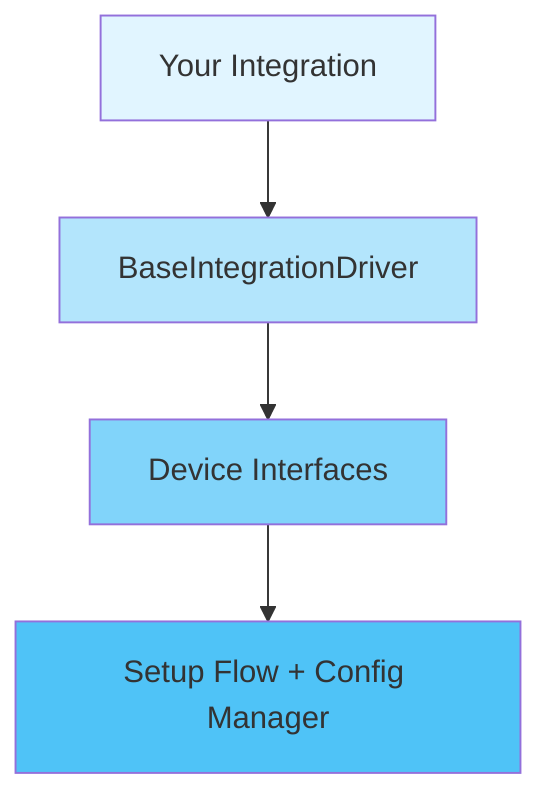

# UCAPI Framework

[](https://github.com/jackjpowell/ucapi-framework/actions/workflows/test.yml)
[](https://discord.gg/zGVYf58)

A framework for building Unfolded Circle Remote integrations that handles the repetitive parts of integration development so you can focus on what's important.

## What This Solves

Building an Unfolded Circle Remote integration typically involves:

- Writing 200+ lines of setup flow routing logic
- Manually managing configuration updates and persistence
- Implementing device lifecycle management (connect/disconnect/reconnect)
- Wiring up Remote event handlers
- Managing global state for devices and entities
- Handling entity registration and state synchronization

This framework provides tested implementations of all these patterns, reducing a simple integration from **~1500 lines of boilerplate to ~400 lines of device-specific code**. It even adds features, like backup and restore, for free.

## Core Features

### :material-playlist-check: Standard Setup Flow with Extension Points

The setup flow handles the common pattern: configuration mode → discovery/manual entry → device selection. But every integration has unique needs, so there are extension points at key moments:

- **Pre-discovery screens** - Collect API credentials or server addresses before running discovery
- **Post-selection screens** - Gather device-specific settings after the user picks a device
- **Custom discovery fields** - Add extra fields to the discovery screen (zones, profiles, etc.)

The framework handles all the routing, state management, duplicate checking, and configuration persistence. You just implement the screens you need.

!!! success "Reduction"
    Setup flow code goes from **~200 lines to ~50 lines**.

### :material-connection: Device Connection Patterns

Five base classes cover the common connection patterns:

=== "StatelessHTTPDevice"
    For REST APIs. You implement `verify_connection()` to test reachability. No connection management needed.

=== "PollingDevice"
    For devices that need periodic state checks. You set a poll interval and implement `poll_device()`. Automatic reconnection on errors.

=== "WebSocketDevice"
    For WebSocket connections. You implement `create_websocket()` and `handle_message()`. Framework manages the connection lifecycle, reconnection, and cleanup.

=== "ExternalClientDevice"
    For third-party libraries that manage their own connections. You implement `create_client()`, `connect_client()`, and `check_client_connected()`. Framework provides watchdog monitoring and auto-reconnection.

=== "PersistentConnectionDevice"
    For TCP, serial, or custom protocols. You implement `establish_connection()`, `maintain_connection()`, and `close_connection()`. Framework handles the receive loop and error recovery.

All connection management, error handling, reconnection logic, and cleanup happens automatically.

!!! success "Reduction"
    Device implementation goes from **~100 lines of connection boilerplate to ~30 lines of business logic**.

### :material-cog: Configuration Management

Configuration is just a dataclass. The framework handles JSON serialization, CRUD operations, and persistence:

```python
from dataclasses import dataclass
from ucapi_framework import BaseConfigManager

@dataclass
class MyDeviceConfig:
    device_id: str
    name: str
    host: str

config = BaseConfigManager("config.json", MyDeviceConfig)
```

You get full CRUD operations: `add_or_update()`, `get()`, `remove()`, `all()`, `clear()`. Plus automatic backup/restore functionality for free. The framework handles all the file I/O, error handling, and atomic writes.

Full type safety means IDE autocomplete works everywhere. No more dict manipulation or manual JSON handling.

!!! success "Reduction"
    Configuration management goes from **~80 lines to ~15 lines**.

### :material-layers: Driver Integration

The driver coordinates everything - device lifecycle, entity management, and Remote events. **Most integrations work with just the defaults** - no overrides needed!

The framework provides sensible defaults for:

- **`create_entities()`** - Creates one entity per entity type automatically
- **`map_device_state()`** - Maps common state strings (ON, OFF, PLAYING, etc.)
- **`device_from_entity_id()`** - Parses standard entity ID format
- **`get_entity_ids_for_device()`** - Queries and filters entities by device

**Override only what you need**: Custom state enums? Override `map_device_state()`. Conditional entity creation? Override `create_entities()`. Custom entity ID format? Override `device_from_entity_id()` too.

Everything else is automatic. The framework handles Remote connection events (connect, disconnect, standby), entity subscriptions, device lifecycle management, and state synchronization.

Device events (like state changes) automatically propagate to entity state updates. The framework maintains the connection between your devices and your remote.

!!! success "Reduction"
    Driver code goes from **~300 lines to ~50 lines** (or less!).

### :material-radar: Discovery (Optional)

If your devices support network discovery, the framework provides implementations for common protocols:

| Discovery Class | Use Case |
|----------------|----------|
| **SSDPDiscovery** | UPnP/SSDP devices |
| **SDDPDiscovery** | SDDP devices (Samsung TVs) |
| **MDNSDiscovery** | mDNS/Bonjour devices |
| **NetworkScanDiscovery** | Active network scanning |
| **BaseDiscovery** | Custom discovery (implement `discover()`) |

All discovery classes handle the protocol details, timeouts, and error handling. Dependencies are lazy-loaded, so you only install what you use.

## Architecture

The framework is layered:



Each layer handles its responsibility and provides clean extension points. You only touch the top layer.

## Type Safety

The framework uses bounded generics (`DeviceT`, `ConfigT`) so your IDE knows exactly what types you're working with:

```python
class MyDriver(BaseIntegrationDriver[MyDevice, MyDeviceConfig]):
    def get_device(self, device_id: str) -> MyDevice | None:
        device = super().get_device(device_id)
        # IDE knows device is MyDevice, full autocomplete available
```

No casting, no generic types, just full type safety throughout.

## Real-World Example

See the PSN integration in this repository:

| File | Before | After |
|------|--------|-------|
| `driver.py` | 300 lines | 90 lines |
| `psn.py` | 240 lines | 140 lines |
| `setup_flow.py` | 250 lines | 50 lines |
| `config.py` | 95 lines | 15 lines |
| **Total** | **885 lines** | **295 lines** |

And the new code is type-safe, testable, and maintainable.

## Requirements

- Python 3.11+
- ucapi
- pyee

**Optional** (only if you use them):

- aiohttp (for HTTP devices)
- websockets (for WebSocket devices)
- ssdpy (for SSDP discovery)
- sddp-discovery-protocol (for SDDP discovery)
- zeroconf (for mDNS discovery)

## Installation

```bash
pip install ucapi-framework
```

Or with uv:

```bash
uv add ucapi-framework
```

## Quick Start

Check out the [Getting Started](getting-started.md) guide to build your first integration in minutes!

## License

Mozilla Public License Version 2.0
